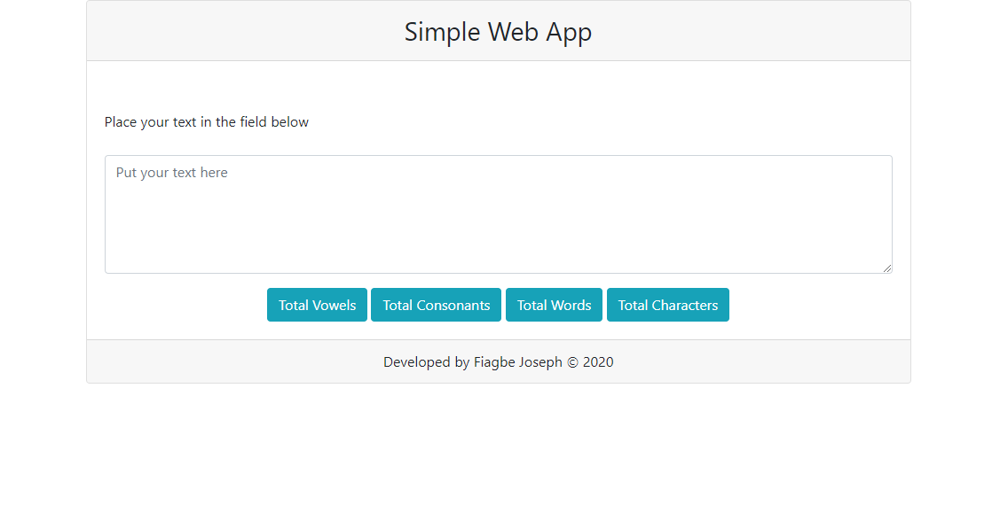

# Simple Web Application

This is a simple web application that process a text input given and provide a simple analysis data. 
Once any of the button below is clicked, some data is displayed in a notification form.

<b>Features </b>  
1. Input text box that can contain over 1000 characters.
2. Button to show the number of vowels in the input box.
3. Button to show the number of consonants in the input box.
4. Button that will count each word in the input box.
5. Button that will count the total characters in the input box.

<b>Programming Languages Used</b> 
This application was developed with PHP Hypertext Preprocessor (PHP) and can be hosted and accessed on an apache or web server that can run PHP scripts. 
Other languages such as Hypertext Markup Language (HTML)  was used for the web elements, Casscading Style Sheets (CSS) was use for styling the elements and JavaScript (JS) was used for some animation and as a bridge to post and retrieve results of processing from the serverside.

<b>Libraries</b> 
Boostrap 4.5 : Used for styling the webpage with native CSS  
JQuery 3.5 : Library with predefined functions and classes built on JavaScript

<b>User Interface Note</b> 
Designed with Boostrap predefined classes like 'card' and used in combination with custom Style Sheet 'mystyle'. 

<b>Reasons for Libraries Used</b> 
JQuery is used for ease, faster and efficient development of the application since it has been tested as components that can be reusable, Also Boostrap was used for designing of the interface. JQuery Ajax was used to handle the Server post and retrival of results after processing. However it was used because of the feature of having to process data from the input field without reloading the webpage, so you check the number of vowels, consonants, characters and words of the same text provided in the input box.

<b>Deployment Steps</b>
1. Download the project folder as zip to your computer.
2. Move the file to the document root of your server that supports or can serve <b>PHP</b> scripts.
3. Unzip the file to this directory.
4. Start your server service
5. Acces the application via a browser with the link "http://localhost/simplewebapp" or for domain users "http://yourdomain/simplewebapp" or for host with Ips, "http://ip-of-hostserver/simplewebapp"

<b>Developer</b> 
Developed by Fiagbe Joseph.

